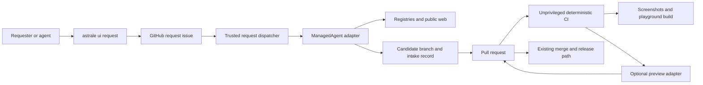

# Candidate architecture

## Ownership



| Owner | Responsibility | Explicitly does not own |
| --- | --- | --- |
| `request/` | Intake semantics, retained provenance shape, admission checks, evidence contract | Model, provider list, GitHub client, preview vendor |
| Astrale CLI | Query admission, issue-form URL, browser/JSON presentation | Research, classification, GitHub credentials |
| GitHub issue | User need, clarification, collaboration state | Source or product authority |
| Request dispatcher | Objective compilation, trusted provider selection, attempt/run binding, reconciliation | Provider HTTP/status translation |
| [`request/agent`](../../agent/README.md) | Portable managed job/run/failure/PR contract | Research policy, public provider selection, merge/release |
| Concrete managed agent | Web research, candidate comparison, source adaptation, branch and PR authorship | License approval, merge approval, release |
| Registry/package owners | Canonical addresses, source, dependencies, distribution | Request state |
| Search owner | Derived discoverability for merged entries | Intake or provider discovery |
| Playground | Canonical previews, deep links, screenshots, HMR | Production package behavior |
| CI | Deterministic admission and unprivileged execution evidence | Open-ended research or design judgment |
| Preview adapter | Host one isolated static PR build and report its URL | Request semantics or source admission |

## The small deterministic kernel

The production implementation should be one generated/diff-driven checker, not a workflow engine:

```text
merge-base diff
  + retained intake record
  + package exports
  + registry manifests
  + preview manifests
  -> changed owned surfaces
  -> exact provenance and adaptation closure
  -> existing build/search/catalog/install checks
  -> evidence manifest
```

No list of component families, registries, or providers belongs in request code. The checker derives
changed surfaces from Git and their authorities from current manifests. Adding a provider requires
data in an intake record, not code in the pipeline.

## Agent boundary

The research actor is reached through the candidate [`ManagedAgent`](../../agent/.history/v1/api.d.ts)
port: dispatch one complete repository job, observe one opaque run, and receive one ordinary PR.
Concrete provider APIs, credentials, sessions, models, environments, tools, and status payloads stay
inside the adapter. Trusted composition injects the selected adapter; the CLI, issue form, and
durable request input never select a provider.

GitHub issue/PR state and the complete objective are portable continuity. A review iteration is a
fresh run against the existing PR, even if an adapter privately reuses a provider session. Two
materially different providers must pass the same contract suite before this seam is considered
proven portable.

The agent performs interpretation where determinism is false economy:

- expanding a human need into search language;
- assessing demos and behavior;
- comparing candidate fitness;
- deciding whether an existing entry is close enough;
- mapping real source anatomy to current Astrale owners; and
- explaining unavoidable tradeoffs.

Scripts own closed facts: digests, paths, dependency closure, address uniqueness, source-to-output
mapping, adaptation diff, catalog/search regeneration, installability, screenshots, and test
results.

The dispatcher durably reserves an attempt before network dispatch and stores the returned opaque
run reference beside the GitHub request. A possibly accepted timeout blocks retry/failover and a
second writer until reconciled. One request/PR branch has at most one non-terminal writer.

## No new runtime dependency

`request/` is repository tooling. Shadcn's documented API may be a root development dependency of
the discovery adapter after ratification; it must not enter `@astrale-os/ui`, generated registry
items, the SDK, or consumer installs. Generic web search remains agent capability rather than a
package dependency.
