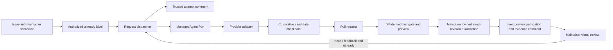

# UI request automation architecture

The GitHub issue body owns the initial human request. Bounded chronological comments and reviews
from repository owners, members, and collaborators refine that intent on the issue and its bound
pull request; public and bot discussion never enters the agent objective. A single trusted machine
comment owns the current managed attempt binding and its exact accepted-discussion snapshot. An owner,
member, or collaborator association is admitted directly;
every other non-bot association requires one cached permission lookup that may admit only write or
admin authority for the current request read.

`ui:ready` is a consumable execution signal, not status authority. An actor with write, maintain, or
admin repository permission may apply it to the request issue or its bound open proposal; the
trusted record determines whether the action starts, observes, or revises work. A proposal label is
admitted only when its exact URL matches the request record. Manual dispatch remains the recovery
surface for reconciliation and cancellation.

GitHub Actions concurrency over the canonical numeric issue identity is the production
serialization boundary; the dispatcher does not claim to provide a cross-process compare-and-swap
over GitHub comments. The accepted discussion identifiers and objective digest freeze one attempt;
later discussion can enter only a later attempt. The record remains sufficient
to resume observation after process or workflow restart. A reservation without a known run or an
`AGENT_OUTCOME_UNKNOWN` result remains blocked for operator reconciliation; it never creates a
second writer automatically. After the settlement bound, explicit `reconcile` may bind the one
matching remote run or confirm absence; ambiguity remains blocked.

Each provider/store operation has its own abort timeout, independent of the bounded polling wait.
Provider-specific credential composition is isolated to mutually exclusive trusted workflow steps;
the issue, label gate, CLI, dispatcher, job, and persisted record remain provider-neutral. Accepted
request data may direct product intent but cannot alter repository policy, provenance admission,
credential separation, tools, or qualification.

The default private worker is pinned Codex with GPT-5.6 Luna at maximum reasoning effort. It sees
neither GitHub authority nor publication credentials, and implementation shell commands have no
network access. One eligible implementation or qualification failure may continue through Opus;
authentication, permission, quota, rate-limit, and unknown-outcome failures never escalate. Provider
and model selection remain private adapter concerns and do not enter the managed-agent Port.

Every non-empty candidate is represented by a digest-bound cumulative checkpoint retained for 30
days. A compatible checkpoint is applied before further editing. Tampering, expiry, request drift,
non-descendant base drift, or a patch that no longer applies stops automatic continuation for
operator input; reconstruction from prompt alone is not a recovery path. Unrelated descendant base
commits may retain the cumulative patch. A newly accepted objective retains that patch while reacquiring
its own immutable source evidence and resetting escalation. Target and hard latency values are
observations only. A breach never cancels work or discards its checkpoint.

Candidate source is installed, fast-tested, rendered, and screenshotted in a credential-free job.
A separate publisher receives only the qualified patch and bounded static preview artifact. It may
commit the qualified patch, transfer static bytes to the dedicated preview origin, create a GitHub
deployment, and maintain the single proposal evidence comment; it never executes candidate bytes.
Each proposal revision replaces the same per-PR preview path. Closing the proposal removes that path
and deactivates its deployment.

Regular revisions use a manifest-derived qualification scope. Only a write-authorized
`ui:merge-ready` label starts the complete package gate and four browser shards for one exact head
commit. Their stable aggregator emits a receipt bound to the commit, tree, package, registry,
catalog, toolchain, and all four successful shards. A same-tree merge may rebind that evidence to the
resulting main commit; any tree difference requires fresh qualification. Trusted publishing verifies
the exact receipt and package bytes, then builds and packs only the release package. It never installs
a browser or reruns exhaustive UI traversal.

This automation is repository tooling. It does not enter the published UI package, registry,
search artifacts, playground bundle, CLI install graph, or SDK.
