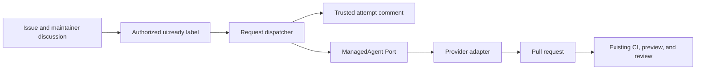

# UI request automation architecture

The GitHub issue body owns the initial human request. Bounded chronological comments from repository
owners, members, and collaborators refine that intent; public and bot comments never enter the
agent objective. A single trusted machine comment owns the current managed attempt binding and its
exact accepted-comment snapshot. GitHub association metadata is authoritative when present; if the
workflow token receives no association, one cached permission lookup for that author may admit only
write or admin authority for the current request read.

`ui:ready` is a consumable execution signal, not status authority. An actor with write, maintain, or
admin repository permission may apply it; the trusted record determines whether the action starts,
observes, or revises work. Manual dispatch remains the recovery surface for reconciliation and
cancellation.

GitHub Actions concurrency over the canonical numeric issue identity is the production
serialization boundary; the dispatcher does not claim to provide a cross-process compare-and-swap
over GitHub comments. The accepted comment identifiers and objective digest freeze one attempt;
later comments can enter only a later attempt. The record remains sufficient
to resume observation after process or workflow restart. A reservation without a known run or an
`AGENT_OUTCOME_UNKNOWN` result remains blocked for operator reconciliation; it never creates a
second writer automatically. After the settlement bound, explicit `reconcile` may bind the one
matching remote run or confirm absence; ambiguity remains blocked.

Each provider/store operation has its own abort timeout, independent of the bounded polling wait.
Provider-specific credential composition is isolated to mutually exclusive trusted workflow steps;
the issue, label gate, CLI, dispatcher, job, and persisted record remain provider-neutral. Accepted
request data may direct product intent but cannot alter repository policy, provenance admission,
credential separation, tools, or qualification.

This automation is repository tooling. It does not enter the published UI package, registry,
search artifacts, playground bundle, CLI install graph, or SDK.
