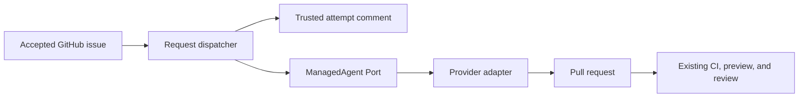

# UI request automation architecture

The GitHub issue owns the human request and a single trusted machine comment owns its current
managed attempt binding. The request dispatcher reserves an attempt before calling the injected
managed-agent Port and updates that same comment as the run changes.

GitHub Actions concurrency over the canonical numeric issue identity is the production
serialization boundary; the dispatcher does not claim to provide a cross-process compare-and-swap
over GitHub comments. The record remains sufficient
to resume observation after process or workflow restart. A reservation without a known run or an
`AGENT_OUTCOME_UNKNOWN` result remains blocked for operator reconciliation; it never creates a
second writer automatically. After the settlement bound, explicit `reconcile` may bind the one
matching remote run or confirm absence; ambiguity remains blocked.

Each provider/store operation has its own abort timeout, independent of the bounded polling wait.
Provider-specific credential composition is isolated to mutually exclusive trusted workflow steps;
the issue, CLI, dispatcher, job, and persisted record remain provider-neutral.

This automation is repository tooling. It does not enter the published UI package, registry,
search artifacts, playground bundle, CLI install graph, or SDK.
