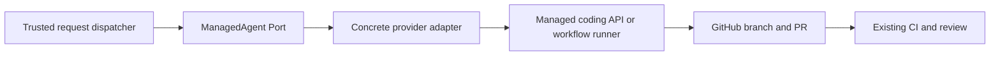

# Managed agent architecture

`request/agent` is a private repository-tooling Port. It normalizes one product journey:

```text
complete repository job -> opaque managed run -> one GitHub pull request
```

The request dispatcher owns admission, provider selection, durable attempt reservation, one-writer
coordination, review iteration, and acceptance. The adapter owns authentication, a pinned provider
API or managed workflow, exact status/failure translation, and provider artifact extraction. GitHub and existing CI own
source continuity, checks, preview evidence, review, and merge.



Provider selection is trusted composition above the Port. Provider models, sessions, tools, MCP,
environment configuration, credentials, event payloads, and cost units remain private. Polling is
the state authority; streams or webhooks may only wake a future reconciler.

Dispatch ambiguity is resolved through the exact reserved attempt marker. GitHub API `2026-03-10`
returns the exact workflow-run id for the Actions adapter; its marker remains the read-only recovery
identity when the dispatch response itself is uncertain. `reconcile` is read-only:
it returns one found run, confirmed absence, ambiguity, or an operation failure and can never start
another writer. GitHub searches exact task-session prompts; Cursor resolves the deterministic
client-supplied agent identity; Actions uses the exact workflow `display_title`.

The implementation uses native `fetch` and no runtime package dependency. The selected workflow
adapter keeps Azure inference and GitHub publication in different steps, so the agent never receives
the publishing credential. Only a bounded inert patch crosses fresh proposal, qualification, and
publisher jobs; candidate code never executes in the publisher. It remains outside the
published UI package, registry, search corpus, playground application graph, SDK, and consumer
installs.
