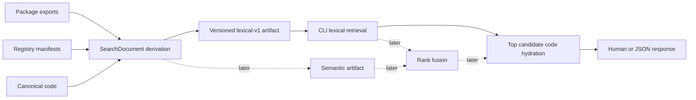

# Architecture

## Responsibility map

| Owner | Owns | Does not own |
| --- | --- | --- |
| `packages/ui/package.json` | Visual runtime subpath inventory | Search descriptions or ranking |
| `registry/**/registry.json` | Registry identity, description, dependencies, and installable files | Search engine or CLI output |
| Canonical runtime previews and registry source | Exact code and mechanically observable behavior | Hand-authored intent tags |
| `search` | Corpus derivation, release search artifact, closure, and stable benchmark workloads | Component product source, registry transformation, or CLI presentation |
| Astrale CLI `ui` owner | Release selection, immutable cache, query execution, code hydration, output, and `add` handoff | Registry content or UI source |
| SDK | No search or UI responsibility | UI dependency, registry, or facade |

## Representation flow



`SearchDocument` is the stable semantic join. The lexical payload, cache representation, future
vector representation, and result-code bytes are earned derived forms with distinct consumers.

Small releases use one compact artifact. Large releases preserve the same logical index but split
term postings and result metadata into independently cacheable parts. Partition counts and family
part membership are generated; neither becomes product taxonomy. One generated manifest owns the
scoring fingerprint, partition map, and compatibility generation; the CLI refuses stale or mixed
generations before query execution.

## Dependency direction

```text
package exports ─┐
registry ────────┼─> search generation ─> immutable release artifact ─> CLI
canonical code ──┘                                                CLI ─> ui add
```

Prohibited back-edges:

- product source importing search code;
- registry manifests containing search-only tags or weights;
- UI search generation depending on CLI implementation;
- SDK importing UI search or registry data; and
- ranking code importing the playground catalog.

## Cold and warm boundaries

Cold release resolution, first artifact download, local artifact load, warm retrieval, and selected
code hydration are measured separately. Caching is keyed only by immutable commit. Cache paths and
atomic-write mechanics remain CLI internals and do not enter the semantic specification.

## Why not a graph or vector-first system

The inventory graph primarily describes composition popularity. It cannot by itself distinguish a
widely imported Button from a specialized exportable payment table. Dense retrieval adds useful
conceptual recall later but weakens exact technical vocabulary and adds query-embedding latency.
V1 therefore establishes a fast exact lexical baseline and a stable fusion boundary, not a
speculative hybrid runtime.
