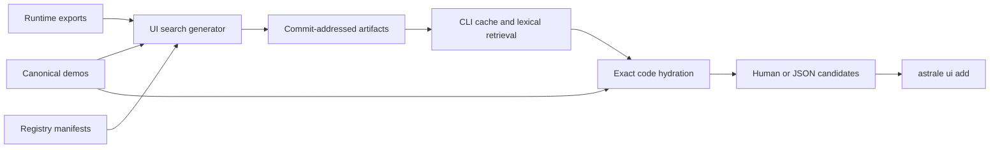

# UI search architecture

Astrale UI owns the immutable search corpus and release artifacts. The CLI owns release identity,
cache admission, retrieval, code hydration, presentation, and installation handoff. The runtime UI
package and SDK own no search data or dependency.

The generated corpus is the exact union of public registry items and visual runtime subpaths. A
release uses one index while it remains within the single-artifact bound and otherwise partitions
term postings and metadata behind the same scorer. Every file and canonical code result carries a
SHA-256 digest. The immutable Git commit is the cache identity.

Search never requires the SDK, never enters the `@astrale-os/ui` npm tarball, and never modifies
component source, styling, DOM anatomy, or registry installation output. Future semantic retrieval
may produce a second ranked set fused with lexical results; it cannot replace exact lexical address
and technical-term retrieval.
